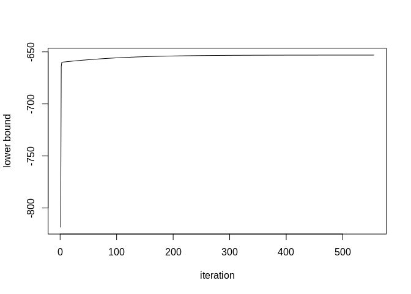

Simple Poisson Mixed Model
================
Benjamin Christoffersen
18 September, 2019

-   [Simulate Data](#simulate-data)
-   [Using TMB (CppAD)](#using-tmb-cppad)
    -   [Two-Step Procedure](#two-step-procedure)
    -   [Optimize with VA](#optimize-with-va)
-   [Using boost autodiff](#using-boost-autodiff)
-   [Compare with Adaptive Gauss-Hermite Quadrature](#compare-with-adaptive-gauss-hermite-quadrature)
-   [References](#references)

This directory contains an example of the Poisson mixed model described in Ormerod and Wand (2010).

Simulate Data
-------------

We simulate data as follows

``` r
set.seed(42163306)
dat_org <- within(list(), {
  sigma <- 1.5      # std of random intercept term
  beta <- c(2, 1.5) # intercept and slope
  grp_size <- 5L    # number of individuals per group
  n_groups <- 50L   # number of groups
  
  # simulate individual specific covariates and observed outcomes
  x <- runif(grp_size * n_groups, -1, 1)
  grp <- rep(1:n_groups, each = grp_size)
  y <- rpois(grp_size * n_groups, lambda = exp(
    beta[1] + beta[2] * x + rnorm(n_groups, sd = sigma)[grp]))
})
```

We assume equal group sizes for simplicity.

Using TMB (CppAD)
-----------------

The following sections uses the `TMB` package which uses the `CppAD` C++ library to perform automatic differentiation. First, we compile the C++ file we need

``` r
library(TMB)
stopifnot(compile("PoisReg.cpp") == 0)
dyn.load(dynlib("PoisReg"))
```

Here is the `PoisReg.cpp` file

``` cpp
#include <TMB.hpp>
#include <stdexcept>

template<class Type>
Type objective_function<Type>::operator() ()
{
  DATA_VECTOR(y);
  DATA_VECTOR(x);
  DATA_INTEGER(grp_size);
  
  PARAMETER(sigma_log);
  PARAMETER_VECTOR(beta);
  PARAMETER_VECTOR(mu);
  PARAMETER_VECTOR(lambda_log);
  
  Type const sigma = exp(sigma_log);
  vector<Type> const lambda = exp(lambda_log);
  
  /* check args. The code currently crash with C++ exceptions though... */
  std::size_t const n = y.size(), n_groups = n / grp_size;
  if(n != (unsigned)x.size() or n < (unsigned)grp_size or n % grp_size > 0)
    throw std::invalid_argument("sizes differ");
  if(n_groups != (unsigned)mu.size() or n_groups != (unsigned)lambda.size())
    throw std::invalid_argument("invalid group size");
  
  /* compute lower bound */
  Type lb(0);
  {
    Type const sigma_sq = sigma * sigma;
    lb += n_groups * .5 * (1. - log(sigma_sq));
    
    std::size_t j = 0;
    for(std::size_t i = 0; i < n_groups; ++i){
      Type const 
        lambda_half = lambda[i] * .5,
               term = mu[i] + lambda_half;
      lb += .5 * (log(lambda[i]) - (mu[i] * mu[i] + lambda[i]) / sigma_sq);
      
      std::size_t const n_j = (i + 1) * grp_size;
      for(; j < n_j; ++j)
        lb += dpois(y[j], exp(beta[0] + beta[1] * x[j] + term), true) - 
            y[j] * lambda_half;
    }
  }
  
  return lb;
}
```

### Two-Step Procedure

We define a function which returns a function which optimizes a subset of the parameters. This will allow us to iterate between optimizing the variational parameters and the model parameters.

``` r
get_opt_func <- function(params_update, reltol = 1e-5){
  eval(bquote(function(obj, verbose = FALSE){
    # setup the objects we need
    par_all <- obj$par
    idx_update <- names(par_all) %in% .(params_update)
    par <- par_all[idx_update]
    fn <- obj$fn
    gr <- obj$gr
    
    # setup functions we need
    fn_use <- function(x, ...){
      z <- par_all
      z[idx_update] <- x
      fn(z)
    }
    gr_use <- function(x, ...){
      z <- par_all
      z[idx_update] <- x
      drop(gr(z))[idx_update]
    }
    
    # optimize
    opt_res <- optim(par, fn = fn_use, gr = gr_use, method = obj$method, 
                     control = list(fnscale = -1, maxit = 1000L, 
                                    reltol = .(reltol)))
    if(opt_res$convergence > 0)
      stop(sprintf("optim failed with code %d\n", opt_res$convergence))
    obj$par[idx_update] <- opt_res$par
    obj$value <- opt_res$value
    
    # print and return
    if(verbose){
      cat(sprintf("\nLower bound is %.4f. Parameters estimates are:\n", 
                  obj$value))
      print(obj$par[idx_update])
    }
    
    obj
  }))
}
```

### Optimize with VA

Next, we use the two-step procedure. First, we get an object which gives a function to evaluate the lower bound, a function to evaluate the gradient of the lower bound, etc.

``` r
# starting values
params <- with(dat_org, list(
   sigma_log = 0,
        beta = c(log(mean(y)), 0),
          mu = rep(0, n_groups),
  lambda_log = rep(0, n_groups)))

# assign object with lower bound function, gradient, etc. 
ad_func <- MakeADFun(
  data = dat_org[c("y", "x", "grp_size")], parameters = params, DLL = "PoisReg",
  silent = TRUE)
```

Then we use the two-step procedure

``` r
# assign function to perform two-step procedure
optim_two_step <- function(obj, maxit = 1000L, eps = 1e-8, verbose = FALSE){
  opt_variational <- get_opt_func(c("mu", "lambda_log"), reltol = eps)
  opt_params <- get_opt_func(c("sigma_log", "beta"), reltol = eps)
  
  lbs <- rep(NA_real_, maxit)
  lb_old <- -.Machine$double.xmax
  for(i in 1:maxit){
    obj <- opt_variational(obj, verbose = FALSE)
    obj <- opt_params(obj, verbose = verbose && (i - 1L) %% 10 == 0)
    
    val <- obj$value
    lbs[i] <- val
    if(abs((val - lb_old) / lb_old) < eps)
      break
    lb_old <- val
  
  }
  
  obj$n_it <- i
  obj$lbs <- lbs[1:i]
  obj
  
}

# optimize parameters
two_est <- optim_two_step(ad_func)

# plot of lower bound versus iteration index
plot(two_est$lbs, xlab = "iteration", ylab = "lower bound", type = "l")
```



``` r
# parameter estimates
two_est$par[names(two_est$par) == "beta"]
```

    ##  beta  beta 
    ## 1.739 1.470

``` r
exp(two_est$par["sigma_log"])
```

    ## sigma_log 
    ##     1.281

We can compare this to optimizing over all parameters

``` r
ad_func$control <- list(fnscale = -1, maxit = 1000L)
one_est <- do.call(optim, ad_func)

# compare results
two_est$par[1:3] - one_est$par[1:3]
```

    ##   sigma_log        beta        beta 
    ## -0.00032359  0.02689553  0.00004424

Using boost autodiff
--------------------

We can also use the proposed boost library [`autodiff`](https://github.com/pulver/autodiff). An implementation is available in the [SimpleVAPois](SimpleVAPois/) directory. In particular, see the [`SimpleVAPois/src/optim_boost.cpp`](SimpleVAPois/src/optim_boost.cpp) file which content is shown below

``` cpp
#include <boost/math/differentiation/autodiff.hpp>
#include <RcppArmadillo.h>
#include <stdexcept>
#include <vector>
#include <cmath>

using namespace boost::math::differentiation;
using std::size_t;

namespace {
/* class to evaluate lower bound terms, gradient of lower bound, etc.
 * for each group */
class lb_group {
  size_t const grp_size;
  double const * const y_start, * const x_start;

  /* function to evalute LB */
  template<typename L, typename M, typename S, typename B0, typename B1>
  promote<L, M, S, B0, B1> lb_wo_constant_inner
    (L const &lambda_log, M const &mu, S const &sigma_log,
     B0 const &b0, B1 const &b1) const {
    auto const sigma  = exp(sigma_log); /* TODO: could be moved */
    auto const lambda = exp(lambda_log),
          lambda_half = lambda * .5;

    auto const term1 =
      .5 * (lambda_log - (mu * mu + lambda) / (sigma * sigma))
      /* TODO: could be moved */
      - sigma_log;

    /* compute terms from conditional density */
    auto get_lp_term = [&](double const y, double const x){
      auto const lp = b0 + b1 * x + mu;
      return y * lp - exp(lp + lambda_half);
    };

    /* assume that there is at least one term... */
    double const * yi = y_start, * xi = x_start;
    auto term2 = get_lp_term(*yi++, *xi++);
    for(size_t i = 1; i < grp_size; ++i)
      term2 += get_lp_term(*yi++, *xi++);

    return term1 + term2;
  }

public:
  /* normalization constant. Can make evaluations cheaper if we make
   * repeated calls with different parameters */
  double const norm_constant = ([&](){
    double out(-0.693147180559945) /* log(1/2) */;
    double const *y_i = y_start;
    for(size_t i = 0; i < grp_size; ++i)
      out -= std::lgamma(*y_i++ + 1);
    return out;
  })();

  lb_group
  (size_t const grp_size, double const * const y_start,
   double const * const x_start):
  grp_size(grp_size), y_start(y_start), x_start(x_start) { }

  template<size_t Ol,
           typename ::size_t Om  = Ol, typename ::size_t Os = Ol,
           typename ::size_t Ob0 = Ol, typename ::size_t Ob1 = Ol >
  auto lb_wo_constant
    (double const &lambda_log, double const &mu, double const &sigma_log,
     double const &b0, double const &b1) const {
    auto const vars = make_ftuple<double, Ol, Om, Os, Ob0, Ob1>(
      lambda_log, mu, sigma_log, b0, b1);
    auto const &vla = std::get<0>(vars);
    auto const &vmu = std::get<1>(vars);
    auto const &vsi = std::get<2>(vars);
    auto const &vb0 = std::get<3>(vars);
    auto const &vb1 = std::get<4>(vars);

    return lb_wo_constant_inner(vla, vmu, vsi, vb0, vb1);
  }

  /* could make a method to optimize (mu, lambda) given (sigma, beta) e.g.,
   * using nloptr which has a C interface */
};

/* util class to compute given order derivatives */
template<size_t order>
class comp_out {
public:
  double lb;
  arma::vec gr;

  comp_out
    (std::vector<lb_group> const &grps, arma::vec const &lambda_log,
     arma::vec const &mu, double const sigma_log, arma::vec const &beta) {
    lb = 0;
    if(order > 0)
      gr.zeros(2 * grps.size() + 3);
    size_t im = 3, is = grps.size() + 3, i = 0L;

    for(auto const &g : grps){
      {
        /* TODO: this is a bit stupid if order > 0... */
        auto obj = g.lb_wo_constant<0>(
          lambda_log[i], mu[i], sigma_log, beta[0], beta[1]);
        lb += obj.derivative(0, 0, 0, 0, 0) + g.norm_constant;
      }

      if(order > 0){
        /* lambda to get first order partial derivative */
        auto func = [&](unsigned const arg){
          if(arg == 0)
            return g.lb_wo_constant<1, 0, 0, 0, 0>
              (lambda_log[i], mu[i], sigma_log, beta[0], beta[1]).
               derivative(1, 0, 0, 0, 0);
          else if(arg == 1)
            return g.lb_wo_constant<0, 1, 0, 0, 0>
              (lambda_log[i], mu[i], sigma_log, beta[0], beta[1]).
               derivative(0, 1, 0, 0, 0);
          else if(arg == 2)
            return g.lb_wo_constant<0, 0, 1, 0, 0>
              (lambda_log[i], mu[i], sigma_log, beta[0], beta[1]).
               derivative(0, 0, 1, 0, 0);
          else if(arg == 3)
            return g.lb_wo_constant<0, 0, 0, 1, 0>
              (lambda_log[i], mu[i], sigma_log, beta[0], beta[1]).
               derivative(0, 0, 0, 1, 0);
          else if(arg == 4)
            return g.lb_wo_constant<0, 0, 0, 0, 1>
              (lambda_log[i], mu[i], sigma_log, beta[0], beta[1]).
               derivative(0, 0, 0, 0, 1);

          throw std::invalid_argument("invalid 'arg'");
        };

        gr[0]    += func(2);
        gr[1]    += func(3);
        gr[2]    += func(4);
        gr[is++]  = func(0);
        gr[im++]  = func(1);
      }

      ++i;
    }
  }
};

/* wrap a T to an R list */
template<class T>
Rcpp::List wrap_return_obj(T const &x){
  return Rcpp::List::create(
    Rcpp::Named("lb") = x.lb, Rcpp::Named("gr") = std::move(x.gr));
}
}

//' @export
// [[Rcpp::export]]
Rcpp::List optim_VA_boost
  (arma::vec const &y, arma::vec const &x, double const sigma_log,
   arma::vec const &beta, arma::vec const &lambda_log, arma::vec const &mu,
   unsigned const grp_size, unsigned const order){
  size_t const n = y.n_elem,
        n_groups = n / grp_size;

  /* check arguments */
  if(n != x.n_elem or n < grp_size or n % grp_size > 0)
    throw std::invalid_argument("sizes differ");
  if(n_groups != mu.n_elem or n_groups != lambda_log.n_elem)
    throw std::invalid_argument("invalid group size");
  if(order > 1)
    throw std::invalid_argument("invalid order");
  if(beta.n_elem != 2)
    throw std::invalid_argument("invalid beta");

  /* setup object for each group */
  std::vector<lb_group> const lb_groups = ([&](){
    std::vector<lb_group> out;
    out.reserve(n_groups);

    double const *x_start = x.begin(), *y_start = y.begin();
    for(size_t i = 0; i < n_groups;
        ++i, y_start += grp_size, x_start += grp_size)
      out.emplace_back(grp_size, y_start, x_start);

    return out;
  })();

  /* compute and return */
  if(order == 0)
    return wrap_return_obj(comp_out<0>(
        lb_groups, lambda_log, mu, sigma_log, beta));

  return wrap_return_obj(comp_out<1>(
      lb_groups, lambda_log, mu, sigma_log, beta));
}
```

We compare whether we get the same for the lower bound, gradient, and the computation time below

``` r
library(SimpleVAPois)

local({
  # output from tmb
  lb_tmb <- ad_func$fn(ad_func$par)  
  gr_tmb <- ad_func$gr(ad_func$par)
  
  # output using boost 
  na <- names(ad_func$par)
  f <- function()
    SimpleVAPois::optim_VA_boost(
      y = dat_org$y, x = dat_org$x, grp_size = dat_org$grp_size, order = 1L,
      sigma_log  = ad_func$par["sigma_log"], 
      beta       = ad_func$par[na == "beta"], 
      lambda_log = ad_func$par[na == "lambda_log"], 
      mu         = ad_func$par[na == "mu"])
  autodiff_out <- f()
  
  # compare
  cat(sprintf("Difference in lower bound is %f\n", 
              lb_tmb - autodiff_out$lb))
  cat(sprintf("Max abs difference between gradient elements are %.16f\n", 
              max(abs(drop(autodiff_out$gr) - drop(gr_tmb)))))
  
  # end by comparing computation time
  microbenchmark::microbenchmark(
    `TMB (CppAd)` = ad_func$gr(ad_func$par), 
    `boost autodiff` = f(), times = 100)
})
```

    ## Difference in lower bound is 59.657359
    ## Max abs difference between gradient elements are 0.0000000000050022

    ## Unit: microseconds
    ##            expr    min     lq   mean median     uq    max neval
    ##     TMB (CppAd)  44.47  45.11  46.42  45.96  46.72  73.83   100
    ##  boost autodiff 127.30 128.66 130.94 129.21 130.03 184.92   100

I am not entirely why the two lower bounds differ (it has been suggested that maybe it is the `dpois` function in `TMB`). Admittedly, I have not spend a lot of time looking into the discrepancy. Though, the gradients do match. The time comparison is not completely fair as I e.g., take the exponential of the log random intercepts' standard deviations the number of groups times with the boost `autodiff` implementation and only once with the `TMB` implementation.

Compare with Adaptive Gauss-Hermite Quadrature
----------------------------------------------

We can compare the result with using adaptive Gauss-Hermite quadrature

``` r
library(lme4)
```

    ## Loading required package: Matrix

``` r
lme4_fit <- glmer(y ~ x + (1 | grp), dat_org, poisson(), nAGQ = 10)
(lme4_fit_sum <- summary(lme4_fit))
```

    ## Generalized linear mixed model fit by maximum likelihood (Adaptive
    ##   Gauss-Hermite Quadrature, nAGQ = 10) [glmerMod]
    ##  Family: poisson  ( log )
    ## Formula: y ~ x + (1 | grp)
    ##    Data: dat_org
    ## 
    ##      AIC      BIC   logLik deviance df.resid 
    ##    449.0    459.6   -221.5    443.0      247 
    ## 
    ## Scaled residuals: 
    ##     Min      1Q  Median      3Q     Max 
    ## -2.1063 -0.6417 -0.0501  0.5902  2.2573 
    ## 
    ## Random effects:
    ##  Groups Name        Variance Std.Dev.
    ##  grp    (Intercept) 1.65     1.28    
    ## Number of obs: 250, groups:  grp, 50
    ## 
    ## Fixed effects:
    ##             Estimate Std. Error z value Pr(>|z|)    
    ## (Intercept)   1.7113     0.1852    9.24   <2e-16 ***
    ## x             1.4696     0.0371   39.61   <2e-16 ***
    ## ---
    ## Signif. codes:  0 '***' 0.001 '**' 0.01 '*' 0.05 '.' 0.1 ' ' 1
    ## 
    ## Correlation of Fixed Effects:
    ##   (Intr)
    ## x -0.075

``` r
# compare log-likelihood and lower bound
logLik(lme4_fit)
```

    ## 'log Lik.' -221.5 (df=3)

``` r
one_est$value
```

    ## [1] -653.1

We can compare the estimated standard errors

``` r
# from VA
local({
  hess <- ad_func$he(one_est$par)
  out <- sqrt(diag(solve(-hess)))
  names(out) <- names(one_est$par)
  out[1:3]
})
```

    ## sigma_log      beta      beta 
    ##    0.1059    0.1850    0.0371

``` r
# standard errors for beta from glmer
sqrt(diag(lme4_fit_sum$vcov))
```

    ## [1] 0.1852 0.0371

References
----------

Ormerod, J. T., and M. P. Wand. 2010. “Explaining Variational Approximations.” *The American Statistician* 64 (2). Taylor & Francis: 140–53. doi:[10.1198/tast.2010.09058](https://doi.org/10.1198/tast.2010.09058).
